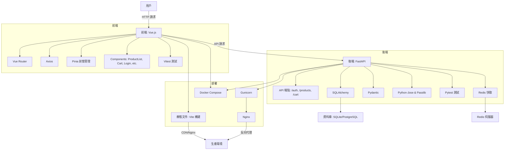

# VueFastMart

VueFastMart 是一個現代化電子商務平台，採用 Vue.js 構建響應式前端，FastAPI 實現高效後端，提供產品瀏覽、購物車管理和用戶認證功能。專案支援管理員產品管理、Redis 快取、JWT 認證，並提供全面的測試覆蓋和 Docker 部署選項。

## 功能概覽

- **用戶認證**：
  - 註冊：創建帳戶（電子郵件和密碼，密碼需至少 8 個字符，包含字母和數字）。
  - 登入：使用電子郵件和密碼生成 JWT 訪問令牌。
  - 用戶資料：查看當前用戶資訊 (`/api/auth/users/me`)。
- **產品管理**：
  - 瀏覽產品：分頁顯示產品列表（名稱、描述、價格、庫存、圖片）。
  - 搜索產品：按名稱模糊搜索。
  - 管理員操作：創建、更新、刪除產品（需認證）。
- **購物車**：
  - 添加項目：將產品加入購物車，自動檢查庫存。
  - 查看購物車：顯示項目詳情和總價。
  - 更新數量：修改購物車項目數量，確保庫存充足。
  - 移除項目：從購物車移除項目並恢復庫存。
- **性能與安全**：
  - Redis 快取：產品列表查詢快取 60 秒。
  - JWT 認證：保護購物車和管理員端點。
  - CORS 和安全標頭：防止跨站請求和安全漏洞。
- **測試與部署**：
  - 自動化測試：後端使用 Pytest，前端使用 Vitest。
  - Docker Compose：一鍵部署應用。

## 系統架構

以下是 VueFastMart 的架構流程圖，展示前端、後端、資料庫、快取和部署的交互：



## 技術棧

- **前端**：
  - Vue.js 3：響應式前端框架。
  - Vue Router：客戶端路由。
  - Pinia：狀態管理。
  - Axios：API 請求。
  - Vitest：單元測試。
  - Tailwind CSS：樣式框架。
- **後端**：
  - FastAPI：高性能 API 框架。
  - SQLAlchemy：ORM 資料庫操作。
  - Redis：快取產品數據。
  - Pydantic：數據驗證。
  - Python-Jose & Passlib：JWT 和密碼哈希。
  - Pytest：單元測試。
- **資料庫**：
  - SQLite（開發環境）。
  - PostgreSQL（生產環境）。
- **部署**：
  - Docker & Docker Compose：容器化部署。
  - Gunicorn & Nginx：生產環境建議。
  - Vercel：前端部署。
  - Render：後端部署。

## 專案結構

```plaintext
VueFastMart/
├── backend/
│   ├── app/
│   │   ├── api/
│   │   │   ├── auth.py        # 用戶認證 API 路由
│   │   │   ├── products.py    # 產品管理 API 路由
│   │   │   └── cart.py        # 購物車 API 路由
│   │   ├── core/              # 核心配置（如依賴注入）
│   │   ├── models/            # SQLAlchemy 模型
│   │   │   ├── user.py
│   │   │   ├── product.py
│   │   │   └── cart.py
│   │   ├── schemas/           # Pydantic 驗證模型
│   │   │   ├── user.py
│   │   │   ├── product.py
│   │   │   └── cart.py
│   │   ├── database.py        # 資料庫連線與 ORM 配置
│   │   ├── cache.py           # Redis 快取實作
│   │   ├── main.py            # FastAPI 主應用
│   │   └── tests/             # 後端測試
│   │       ├── test_auth.py
│   │       ├── test_products.py
│   │       ├── test_cart.py
│   ├── requirements.txt       # 後端依賴
│   ├── .env.example           # 環境變數範例
│   ├── Dockerfile             # 後端 Docker 構建
│   └── uvicorn_start.sh       # Uvicorn 啟動腳本
├── frontend/
│   ├── public/                # 靜態資源
│   ├── src/
│   │   ├── api/               # API 請求服務
│   │   ├── assets/            # 圖片、CSS 等資源
│   │   ├── components/        # Vue 組件
│   │   ├── router/            # Vue Router 配置
│   │   ├── stores/            # Pinia 狀態管理
│   │   ├── views/             # Vue 頁面組件
│   │   ├── App.vue            # 根組件
│   │   └── main.js            # 前端入口
│   ├── tests/                 # 前端測試
│   ├── .env.example           # 環境變數範例
│   ├── Dockerfile             # 前端 Docker 構建
│   ├── package.json           # 前端依賴
│   └── vite.config.js         # Vite 配置
├── .gitignore                 # Git 忽略文件
├── create_project.py          # 專案生成腳本
└── README.markdown            # 專案說明
```

## 後端核心程式碼說明

### `main.py`
- FastAPI 應用入口，初始化應用實例。
- 配置 CORS 中間件，允許前端跨域請求。
- 註冊 `auth`、`products`、`cart` 路由模組。
- 自動創建資料庫表格 (`Base.metadata.create_all`)。
- 添加安全標頭（如 `Content-Security-Policy`）。
- 提供健康檢查路由 (`GET /`).

### `api/auth.py`
- 處理用戶認證：
  - `POST /register`: 註冊用戶，儲存哈希密碼 (`passlib`).
  - `POST /token`: 登入並生成 JWT 令牌 (`jose`).
  - 使用 `OAuth2PasswordBearer` 實現 OAuth2 密碼流程。
- `get_current_user`: 依賴函數，驗證 JWT 並返回當前用戶。

### `api/products.py`
- 產品 CRUD 操作：
  - `GET /`: 分頁獲取產品列表，支援 Redis 快取 (`@cache(timeout=60)`).
  - `POST /`: 創建產品（管理員權限）。
  - `GET /{id}`: 獲取單一產品。
  - `PUT /{id}`: 更新產品（管理員權限）。
  - `DELETE /{id}`: 刪除產品（管理員權限）。

### `api/cart.py`
- 購物車操作：
  - `POST /`: 添加產品，檢查庫存（需登入）。
  - `GET /`: 獲取購物車內容。
  - `DELETE /{id}`: 移除購物車項目。

### `database.py`
- 配置 SQLAlchemy 資料庫連線（支援 SQLite/PostgreSQL）。
- 提供 `SessionLocal` 會話工廠和 `get_db` 依賴注入函數。
- 定義 `Base` 類，供模型繼承。

### `models/` (`user.py`, `product.py`, `cart.py`)
- SQLAlchemy ORM 模型，定義資料庫表格結構。
- 包含欄位、資料類型和外鍵關係（如 `CartItem` 關聯 `User` 和 `Product`）。

### `schemas/` (`user.py`, `product.py`, `cart.py`)
- Pydantic 模型，用於資料驗證和序列化。
- 支援 `*Base`、`*Create` 和響應模型，啟用 `from_attributes` 與 ORM 兼容。

### `cache.py`
- 實現 Redis 快取裝飾器，支援 60 秒快取。
- 生成快取鍵，處理快取命中與儲存邏輯。

## 先決條件

- Node.js：>= 18
- Python：>= 3.12
- Redis：用於快取（可選）
- Docker：用於容器化部署（可選）
- PostgreSQL：生產環境（可選，開發使用 SQLite）

## 安裝與設置

### 1. 生成專案

```bash
python create_project.py
cd VueFastMart
```

### 2. 設置後端

```bash
cd backend
python -m venv venv
source venv/bin/activate  # Windows: venv\Scripts\activate
pip install -r requirements.txt
cp .env.example .env
```

編輯 `backend/.env`：

```plaintext
DATABASE_URL=sqlite:///./vuefastmart.db
SECRET_KEY=your-generated-secret-key
FRONTEND_URL=http://localhost:5173
REDIS_HOST=localhost
REDIS_PORT=6379
```

生成 `SECRET_KEY`：

```bash
openssl rand -hex 32
```

啟動後端：

```bash
uvicorn app.main:app --reload
```

訪問：
- API 文檔：`http://localhost:8000/docs`
- 健康檢查：`http://localhost:8000/health`

### 3. 設置前端

```bash
cd frontend
npm install
cp .env.example .env
```

編輯 `frontend/.env`：

```plaintext
VITE_API_URL=http://localhost:8000
```

啟動前端：

```bash
npm run dev
```

訪問：`http://localhost:5173`

### 4. 運行測試

- **後端**：
  ```bash
  cd backend
  pytest tests/ --cov=app --cov-report=html
  ```
- **前端**：
  ```bash
  cd frontend
  npm run test
  ```

## 部署指引

### 部署前端到 Vercel

1. 推送前端程式碼至 GitHub。
2. 在 Vercel 創建專案，連繫 GitHub 倉庫。
3. 設置環境變數：
   - `VITE_API_URL`: 後端 API 地址（如 `https://vuefastmart-api.onrender.com`）。
4. 部署並獲取前端 URL，更新後端 `FRONTEND_URL`。

### 部署後端到 Render

1. 在 Render 創建 Web Service，連繫 GitHub 倉庫。
2. 設置：
   - 構建命令：`pip install -r requirements.txt`
   - 啟動命令：`gunicorn -w 4 -k uvicorn.workers.UvicornWorker app.main:app`
   - 環境變數：
     - `DATABASE_URL`: PostgreSQL 連線。
     - `SECRET_KEY`: 安全密鑰。
     - `FRONTEND_URL`: Vercel 前端 URL。
     - `REDIS_URL`: Render Redis 服務（若使用）。
3. 啟用自動部署。

### Docker 部署

```bash
docker-compose up --build -d
```

訪問：
- 前端：`http://localhost:5173`
- 後端：`http://localhost:8000/docs`

## API 文檔

- **Swagger UI**：`http://localhost:8000/docs`
- **ReDoc**：`http://localhost:8000/redoc`

主要端點：
- **認證**：
  - `POST /api/auth/register`: 註冊用戶
  - `POST /api/auth/token`: 登入獲取 JWT
  - `GET /api/auth/users/me`: 獲取用戶資訊
- **產品**：
  - `GET /api/products/`: 分頁獲取產品
  - `GET /api/products/search?name=xxx`: 搜索產品
  - `GET /api/products/{id}`: 獲取單一產品
  - `POST /api/products/`: 創建產品（管理員）
  - `PUT /api/products/{id}`: 更新產品（管理員）
  - `DELETE /api/products/{id}`: 刪除產品（管理員）
- **購物車**：
  - `POST /api/cart/`: 添加產品
  - `GET /api/cart/`: 獲取購物車
  - `PUT /api/cart/{id}`: 更新項目數量
  - `DELETE /api/cart/{id}`: 移除項目

## 常見問題

- **後端無法啟動**：
  - 檢查 `backend/.env` 的 `SECRET_KEY` 和 `DATABASE_URL`。
  - 確保資料庫和 Redis 服務運行。
- **前端 API 請求失敗**：
  - 確認 `VITE_API_URL` 指向正確後端地址。
  - 檢查 CORS 設置和後端日誌。
- **快取未生效**：
  - 驗證 Redis 服務運行和 `REDIS_HOST`/`REDIS_PORT` 配置。

## 未來改進

- 訂單管理功能。
- 產品分類與篩選。
- 圖片上傳（例如 S3 整合）。
- 增強安全功能（如密碼重置、兩步驗證）。

## 致謝

感謝 FastAPI、Vue.js 和 Tailwind CSS 社群的優秀工具！本專案受《Python 電商教學》啟發，旨在幫助新手學習全端開發。

## 許可證

本專案採用 [MIT 許可證](LICENSE)。
