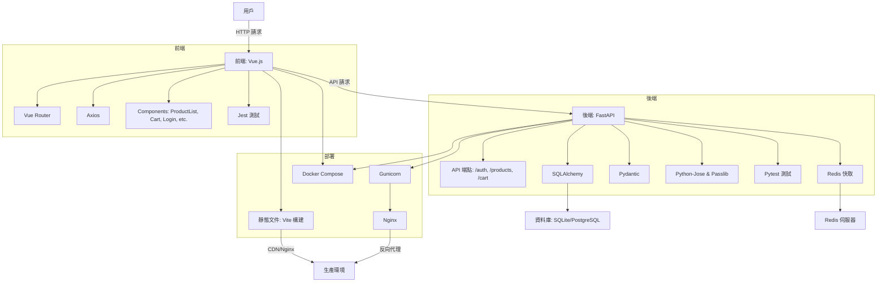

# VueFastMart

VueFastMart 是一個現代化的電子商務平台，採用 Vue.js 構建響應式前端，FastAPI 實現高效後端，提供產品瀏覽、購物車管理和用戶認證功能。專案支援管理員產品管理、Redis 快取、JWT 認證，並提供全面的測試覆蓋和 Docker 部署選項。

## 功能概覽

- **用戶認證**：
  - 註冊：創建帳戶（電子郵件和密碼，密碼需至少 8 個字符，包含字母和數字）。
  - 登入：使用電子郵件和密碼生成 JWT 訪問令牌。
  - 用戶資料：查看當前用戶資訊 (`/api/auth/users/me`)。
- **產品管理**：
  - 瀏覽產品：分頁顯示產品列表（名稱、描述、價格、庫存、圖片）。
  - 搜索產品：按名稱模糊搜索。
  - 管理員操作：創建、更新、刪除產品（需認證）。
- **購物車**：
  - 添加項目：將產品加入購物車，自動檢查庫存。
  - 查看購物車：顯示項目詳情和總價。
  - 更新數量：修改購物車項目數量，確保庫存充足。
  - 移除項目：從購物車移除項目並恢復庫存。
- **性能與安全**：
  - Redis 快取：產品列表查詢快取 60 秒。
  - JWT 認證：保護購物車和管理員端點。
  - CORS 和安全標頭：防止跨站請求和安全漏洞。
- **測試與部署**：
  - 自動化測試：後端使用 Pytest，前端使用 Jest。
  - Docker 支援：使用 Docker Compose 快速部署。

## 系統架構

以下是 VueFastMart 的架構流程圖，展示前端、後端、資料庫、快取和部署的交互：



## 技術棧

- **前端**：
  - Vue.js 3：響應式前端框架。
  - Vue Router：客戶端路由。
  - Axios：API 請求。
  - Jest：單元測試。
- **後端**：
  - FastAPI：高性能 API 框架。
  - SQLAlchemy：ORM 資料庫操作。
  - Redis：快取產品數據。
  - Pydantic：數據驗證。
  - Python-Jose & Passlib：JWT 和密碼哈希。
  - Pytest：單元測試。
- **資料庫**：
  - SQLite（開發環境）。
  - PostgreSQL（生產環境）。
- **部署**：
  - Docker & Docker Compose：容器化部署。
  - Gunicorn & Nginx：生產環境建議。

## 專案結構

```plaintext
VueFastMart/
├── backend/
│   ├── app/
│   │   ├── api/
│   │   │   ├── auth.py
│   │   │   ├── products.py
│   │   │   └── cart.py
│   │   ├── models/
│   │   │   ├── user.py
│   │   │   ├── product.py
│   │   │   └── cart.py
│   │   ├── schemas/
│   │   │   ├── user.py
│   │   │   ├── product.py
│   │   │   └── cart.py
│   │   ├── database.py
│   │   ├── cache.py
│   │   ├── main.py
│   │   └── tests/
│   │       ├── test_auth.py
│   │       ├── test_products.py
│   │       └── test_cart.py
│   ├── requirements.txt
│   ├── .env.example
│   ├── Dockerfile
│   └── docker-compose.yml
├── frontend/
│   ├── src/
│   │   ├── components/
│   │   │   ├── ProductCard.vue
│   │   │   ├── ProductList.vue
│   │   │   ├── ProductDetail.vue
│   │   │   ├── Cart.vue
│   │   │   ├── Register.vue
│   │   │   └── Login.vue
│   │   ├── utils/
│   │   │   └── cart.js
│   │   ├── App.vue
│   │   ├── main.js
│   │   └── router.js
│   ├── tests/
│   │   ├── ProductList.test.js
│   │   └── Cart.test.js
│   ├── package.json
│   ├── vite.config.js
│   └── .env.example
└── README.md
```

## 先決條件

- Node.js：>= 18
- Python：>= 3.12
- Redis：用於快取（可選）
- Docker：用於容器化部署（可選）
- PostgreSQL：生產環境（可選，開發使用 SQLite）

## 安裝與設置

### 1. 生成專案

運行以下命令生成專案結構：

```bash
python create_project.py
cd VueFastMart
```

### 2. 設置後端

```bash
cd backend
python -m venv venv
source venv/bin/activate  # Windows: venv\Scripts\activate
pip install -r requirements.txt
cp .env.example .env
```

編輯 `backend/.env`，設置以下變數：

```plaintext
DATABASE_URL=sqlite:///./vuefastmart.db
SECRET_KEY=your-generated-secret-key
FRONTEND_URL=http://localhost:5173
REDIS_HOST=localhost
REDIS_PORT=6379
```

生成隨機 `SECRET_KEY`：

```bash
openssl rand -hex 32
```

啟動後端：

```bash
uvicorn app.main:app --reload
```

訪問：
- API 文檔：`http://localhost:8000/docs`
- 健康檢查：`http://localhost:8000/health`

### 3. 設置前端

```bash
cd frontend
npm install
cp .env.example .env
```

編輯 `frontend/.env`：

```plaintext
VITE_API_URL=http://localhost:8000
```

啟動前端：

```bash
npm run dev
```

訪問應用：`http://localhost:5173`

### 4. 使用 Docker

```bash
docker-compose up -d
```

- 後端：`http://localhost:8000`
- Redis：`localhost:6379`
- 前端需單獨運行（`npm run dev`），或參考部署部分添加前端 Dockerfile。

## API 文檔

訪問以下地址查看和測試 API：
- **Swagger UI**：`http://localhost:8000/docs`
- **ReDoc**：`http://localhost:8000/redoc`

主要端點：
- **認證**：
  - `POST /api/auth/register`：註冊用戶
  - `POST /api/auth/token`：登入獲取 JWT
  - `GET /api/auth/users/me`：獲取用戶資訊
- **產品**：
  - `GET /api/products/`：分頁獲取產品列表
  - `GET /api/products/search?name=xxx`：搜索產品
  - `GET /api/products/{id}`：獲取單一產品
  - `POST /
